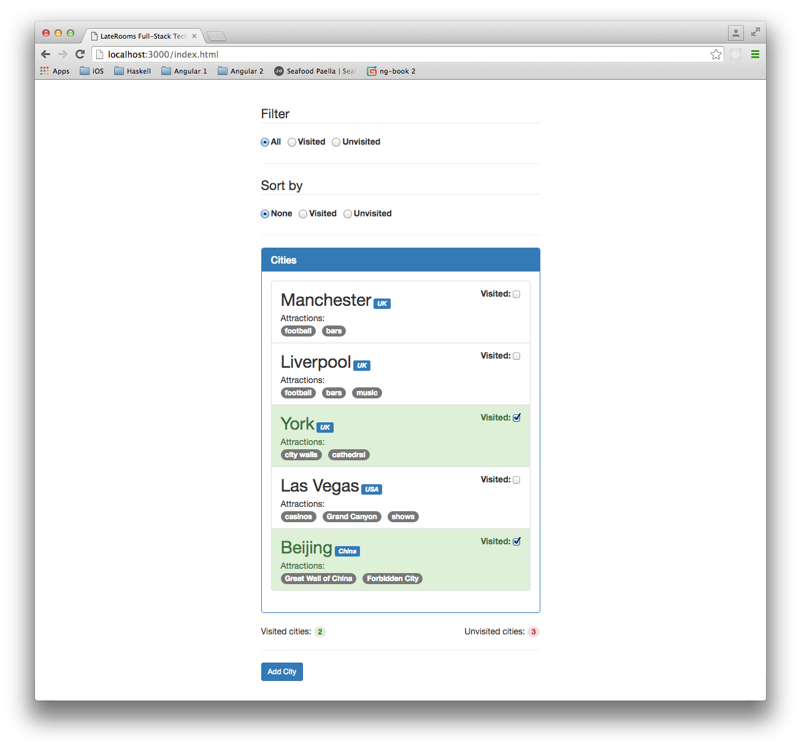
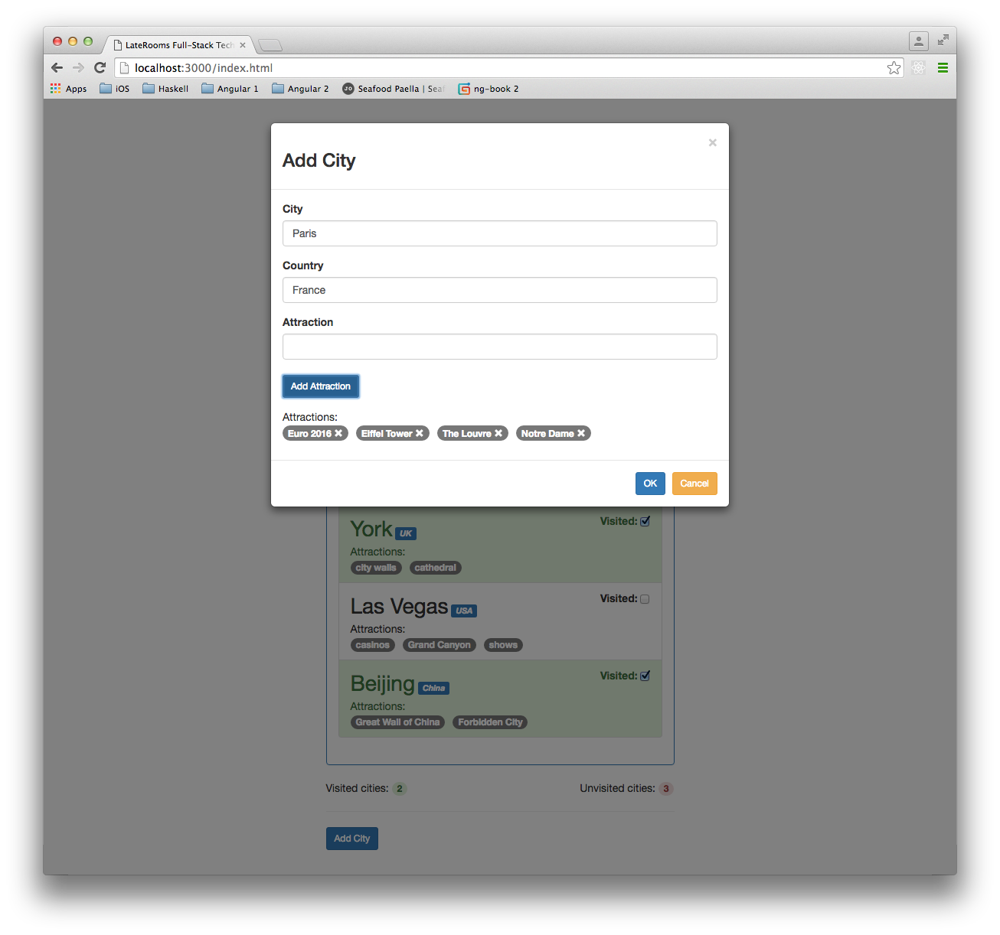
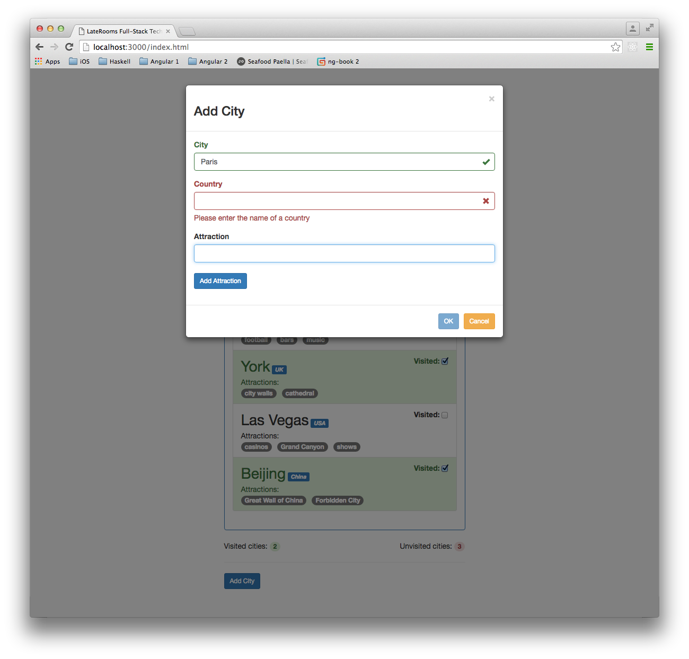
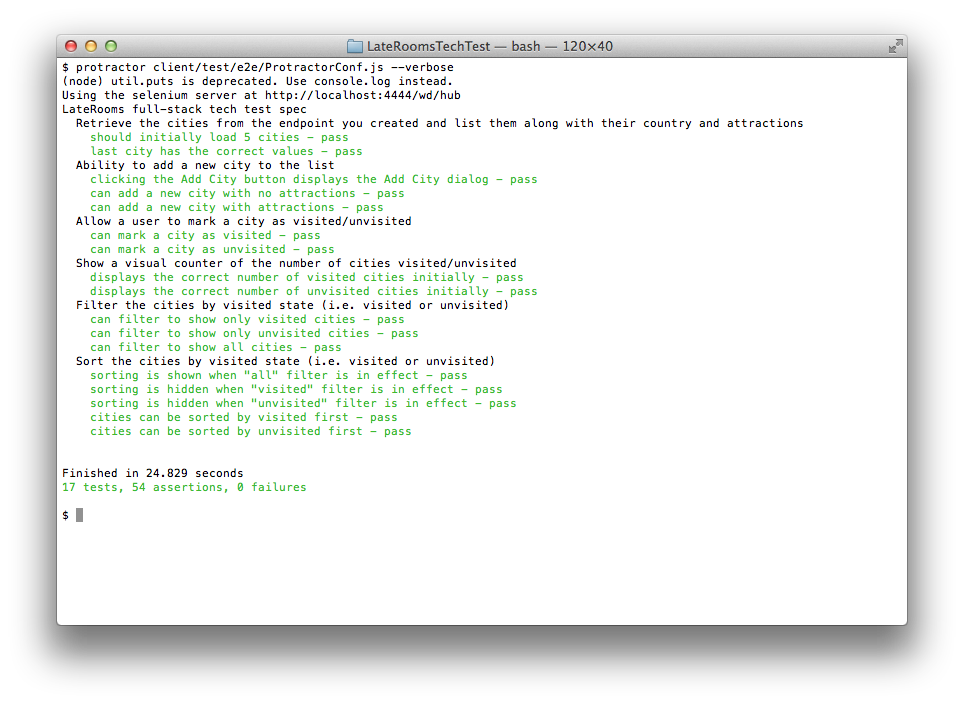

## Description

This is my attempt at the [The LateRooms Group full-stack task](https://github.com/LateRoomsGroup/interview-katas/blob/master/full-stack.md). 

## Screenshots

### Main Page

### Add City Dialog

### Validation in the Add City Dialog

### Protractor Tests 

## TODO

* ~~Add tests re validation in the Add City dialog~~
    * ~~Implement basic validation in the Add City dialog~~
    * ~~Make the validation look a bit prettier~~
* ~~Implement missing in-memory server-side services:~~
    * ~~Add city~~
    * ~~Update city~~
* Add MongoDB support to the server-side
* Implement missing feature: "Search for city by attraction or country"
* Webpack:
    * Do minification
    * Include bootstrap.css
    * Support environments (dev/prod)
* Deploy to [Heroku](https://www.heroku.com/)
* Add spinners re AJAX calls (http interceptor ?)
* Add error handling re AJAX calls (http interceptor ?)
* Test other browsers
* Make the whole thing look nicer e.g. by using [Angular Material](https://material.angularjs.org) instead of [Bootstrap](http://getbootstrap.com/)

## Links

* [The LateRooms Group full-stack task](https://github.com/LateRoomsGroup/interview-katas/blob/master/full-stack.md)
* [Protractor API Documentation](http://www.protractortest.org/#/api)
