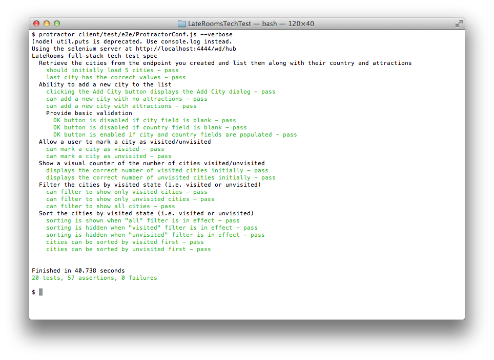

## Description

This is my attempt at the [The LateRooms Group full-stack task](https://github.com/LateRoomsGroup/interview-katas/blob/master/full-stack.md). 

## Screenshots

### Main Page

### Add City Dialog

### Protractor Tests 

## TODO

* Add tests re validation in the Add City dialog
    * Implement validation in the Add City dialog
* Implement missing in-memory server-side services:
    * Add city
    * Update city
* Add MongoDB support to the server-side
* Implement missing feature: "Search for city by attraction or country"
* Webpack:
    * Do minification
    * Include bootstrap.css
    * Support environments (dev/prod)
* Deploy to [Heroku](https://www.heroku.com/)
* Add spinners re AJAX calls (http interceptor ?)
* Add error handling re AJAX calls (http interceptor ?)

## Links

* [The LateRooms Group full-stack task](https://github.com/LateRoomsGroup/interview-katas/blob/master/full-stack.md)
